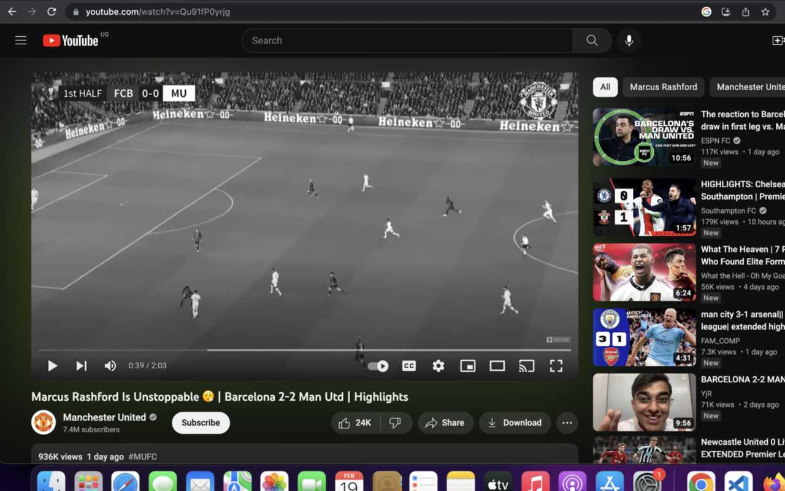

# RETRO YOUTUBE: Watch Youtube in Black and White

This extension lets you watch YouTube videos in retro (Black and White) mode.

## Installation

### Chrome
[https://chrome.google.com/webstore/detail/retro-youtube/iheenkanapligcgegfigbljmbmbiglah](https://chrome.google.com/webstore/detail/retro-youtube/iheenkanapligcgegfigbljmbmbiglah)

### Firefox
[https://addons.mozilla.org/en-US/firefox/addon/retro-youtube/](https://addons.mozilla.org/en-US/firefox/addon/retro-youtube/)

## Debugging / Local Installation

### Firefox

For some reason, this extension does not work in Firefox when using Manifest v3, for that reason, we have a separate Manifest v2 for Firefox

- Clone or download this repository
- Copy everything from `manifest_ff.json` into `manifest.json`
- Go to `about:debugging` (type in the address bar)
- Click *This Firefox* > *Load Temporary Add-On*
- Browse to the extension folder and select `manifest.json`
- Click *Reload* after making any code changes

### Chrome

- Clone or download this repository
- Go to `chrome://extensions` (type in the address bar)
- Click "Load Unpacked" and select the extension folder

## Functionality

This extension finds the video player and adds a black and white filter to it, simple as that.

The extension is supported by Chrome and Firefox.
Safari support is untested.

## Security & Privacy

This extension only has access to `https://www.youtube.com/*` and only accesses the page DOM.

It does not access your Youtube cookies or other personal data in any way.

## Community

Feel free to open issues or submit PRs.

## To-Do

### Test the extension in Safari and submit to Apple's extension store

Safari should support Web Extensions so without any code changes, the same code
should work in Safari, too.
